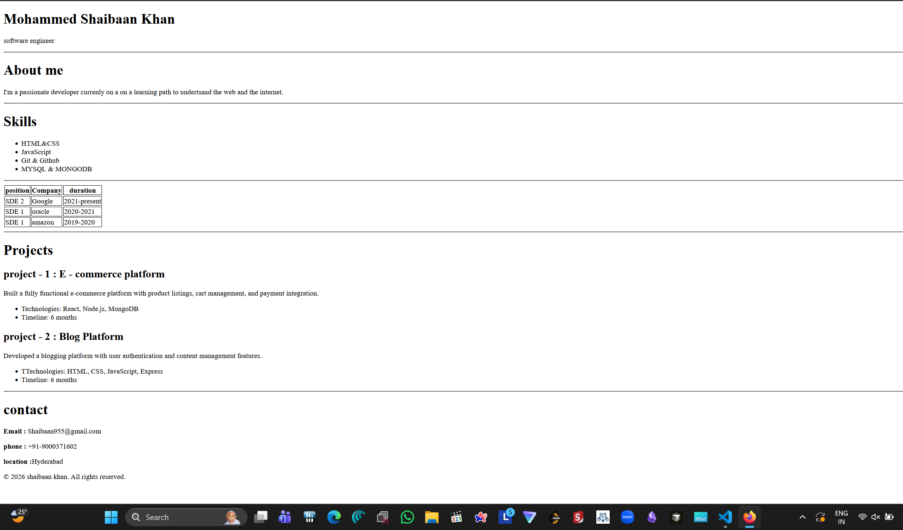

# Resume Website

A clean and structured resume webpage built using semantic HTML and CSS, focusing on readability, alignment, and consistent layout.

---

## 🔗 Live Demo
https://shaibaank.github.io/resume/

---

## 📸 Screenshot



---

## 🚀 Setup Instructions

1. Clone the repository:
   ```bash
   git clone https://github.com/shaibaank/resume.git


resume-project/
├── index.html
├── README.md
└── screenshots/
